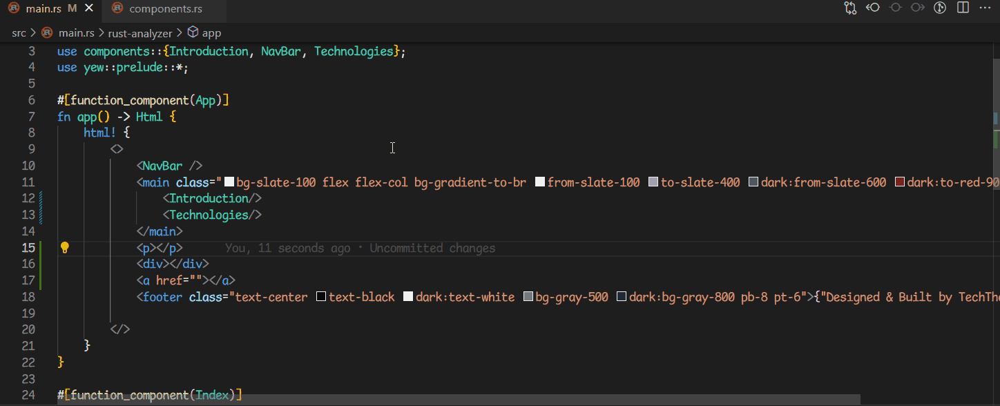

# Rust-Yew

</img>

A VSCode extension that provides some language features for [Yew](https://yew.rs/)'s html macro syntax.

## Features
- Syntax highlighting.
- HTML tags hover. 
- HTML completion suggestions.
- Document symbols.
- Symbols rename. 
- Folding ranges.

## Installation
Get the extension on [VSCode Marketplace](https://marketplace.visualstudio.com/items?itemName=TechTheAwesome.rust-yew&ssr=false) !

## Contributing
For those who are interested in getting involved:
 - Report bugs and request features by opening an issue [here](https://github.com/TechTheAwesome/code-yew-server/issues).
 - Contribute code or documentation by forking the repository and submitting a pull request [here](https://github.com/TechTheAwesome/code-yew-server/pulls).

### Unplanned / required help
Here's some long standing issues/feature that I would require assistance on if they were to be implemented.
- [ ] Formatting support.
- [ ] Language configuration crossing between rust & macro syntax. [Issue](https://github.com/TechTheAwesome/code-yew-server/issues/19)

## Acknowledgements
- Inspiration taken from [yew-highlighting](https://github.com/Alexandre-Borghi/yew-highlighting). 
- Follows the amazingly detailed guide for [embedded languages](https://code.visualstudio.com/api/language-extensions/embedded-languages).
